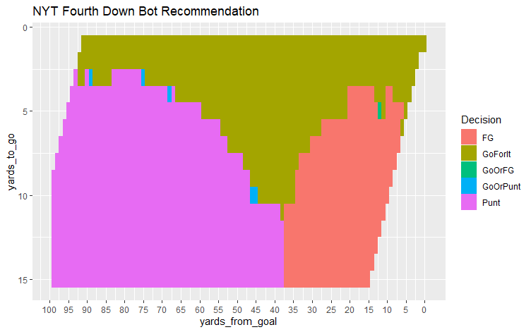

# NFLSimulatoR 
R Package for simulating drives in the NFL using NFLScrapR data.

<!-- badges: start -->
  
  <!-- badges: end -->

## Website  
The nflsimulator package website is hosted at [datacolorado.com/nflsimulator](http://datacolorado.com/nflsimulator).

### Overview
**nflsimulator** is an R Package that provides an array of functions for sampling NFL data as well as testing various strategies fof fourth down decision making. 

### Getting Started

If you are just getting started with **nflsimulator** we recommend...

### Resources

* [Open an issue](https://github.com/rtelmore/nflsimulator/issues) (GitHub issues for bug reports, feature requests)

### Examples 

